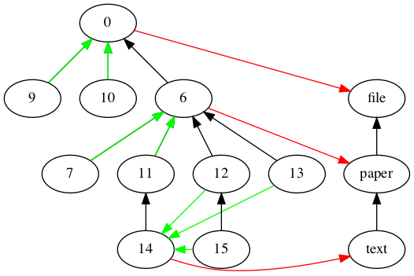
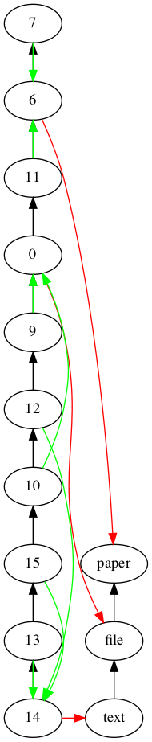

.. scikit-gtimage documentation master file, created by
   sphinx-quickstart on Thu Oct 15 11:06:34 2015.
   You can adapt this file completely to your liking, but it should at least
   contain the root `toctree` directive.

Quick start : an example
========================

Code example:
*************

.. literalinclude:: ../../examples/example.py
   :language: python
   :lines: 2-
   :linenos:

Output (using matplotlib):
**************************

.. image:: _static/figure_1.png
   :scale: 70 %
   :alt: Produced result

Inexact graph matching (inclusion - requires pygraphviz):
*********************************************************

Inexact graph matching (photometry - requires pygraphviz):
**********************************************************

