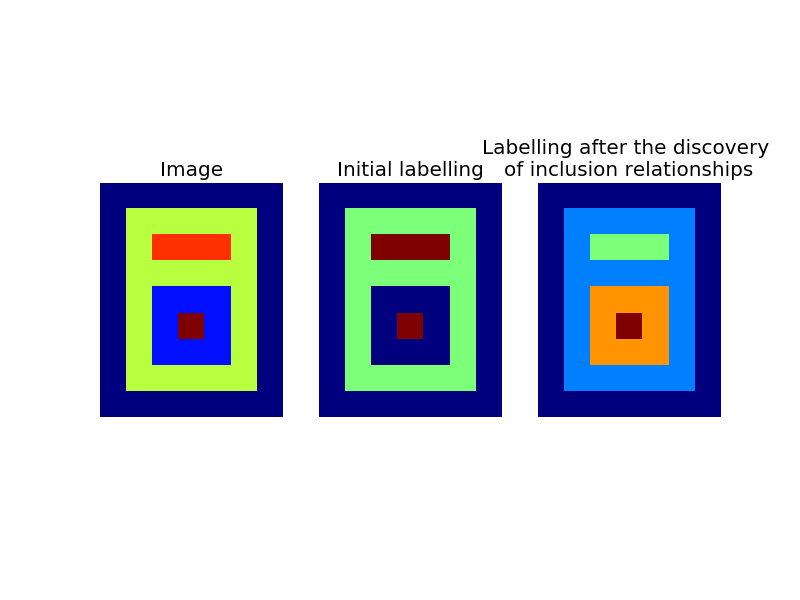
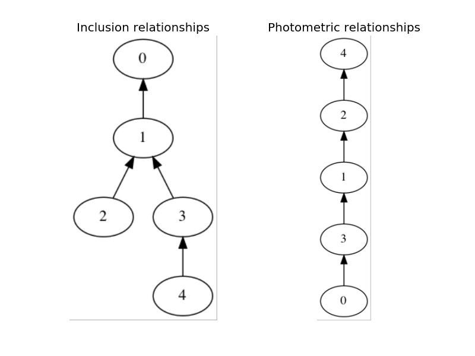
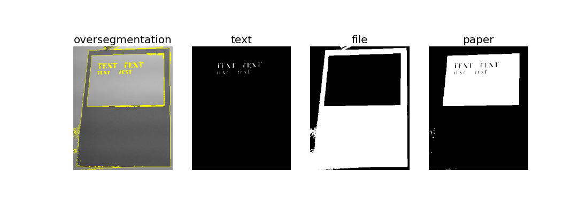
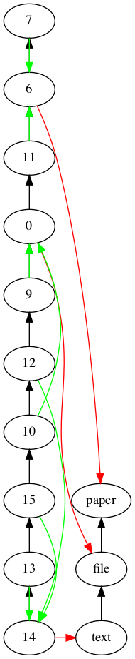
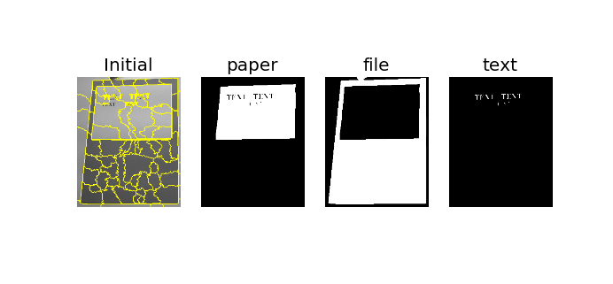
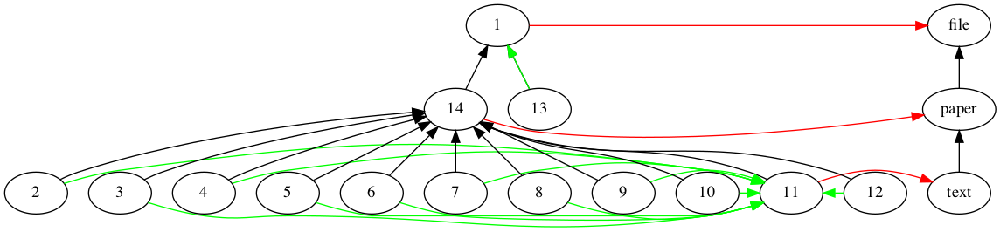
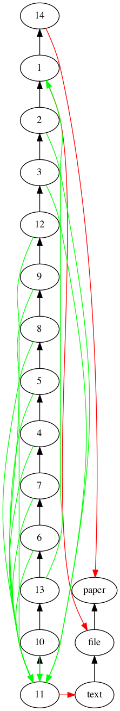
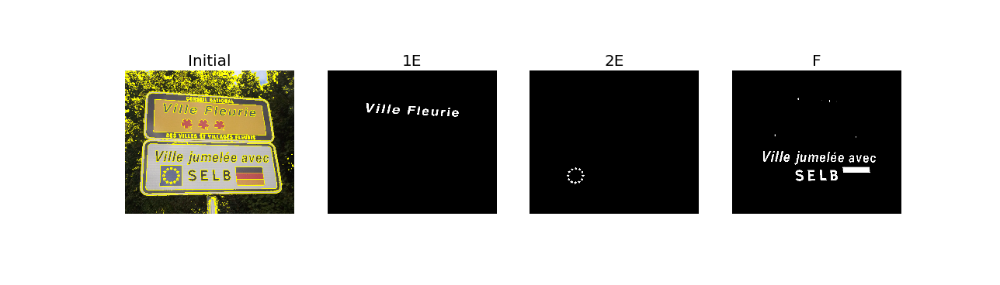
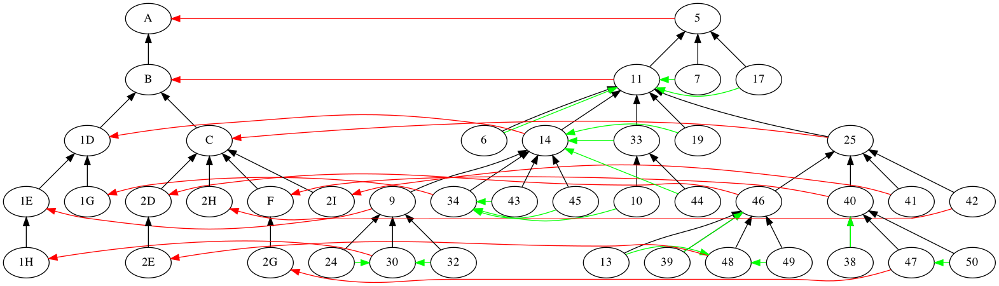
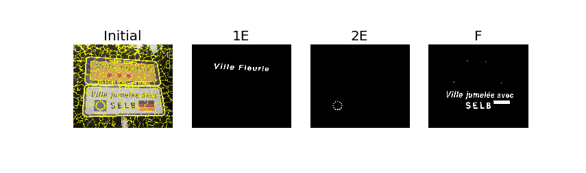

.. scikit-gtimage documentation master file, created by
   sphinx-quickstart on Thu Oct 15 11:06:34 2015.
   You can adapt this file completely to your liking, but it should at least
   contain the root `toctree` directive.

Quick start : example 0
=======================

Code (graph building from labelling):
*************************************

.. literalinclude:: ../../examples/example0.py
   :language: python
   :lines: 2-
   :linenos:

Output (using matplotlib):
**************************

Resulting graphs (requires pygraphviz):
***************************************

Quick start : example 1
=======================

Code (mean shift segmentation):
*******************************

.. literalinclude:: ../../examples/example1.py
   :language: python
   :lines: 2-
   :linenos:

Output (using matplotlib):
**************************

Inexact graph matching (inclusion - requires pygraphviz):
*********************************************************

.. image:: _static/matching_t_1.png
   :scale: 100 %
   :alt: Produced result

Inexact graph matching (photometry - requires pygraphviz):
**********************************************************

Quick start : example 2
=======================

Code (quick shift segmentation):
********************************

.. literalinclude:: ../../examples/example2.py
   :language: python
   :lines: 2-
   :linenos:

Output (using matplotlib):
**************************

Inexact graph matching (inclusion - requires pygraphviz):
*********************************************************

Inexact graph matching (photometry - requires pygraphviz):
**********************************************************

Quick start : example 3
=======================

Code (quick shift segmentation):
********************************

.. literalinclude:: ../../examples/example3.py
   :language: python
   :lines: 2-
   :linenos:

Output (using matplotlib):
**************************

Inexact graph matching (inclusion - requires pygraphviz):
*********************************************************

Quick start : example 4
=======================

Code (quick shift segmentation):
********************************

.. literalinclude:: ../../examples/example4.py
   :language: python
   :lines: 2-
   :linenos:

Output (using matplotlib):
**************************

